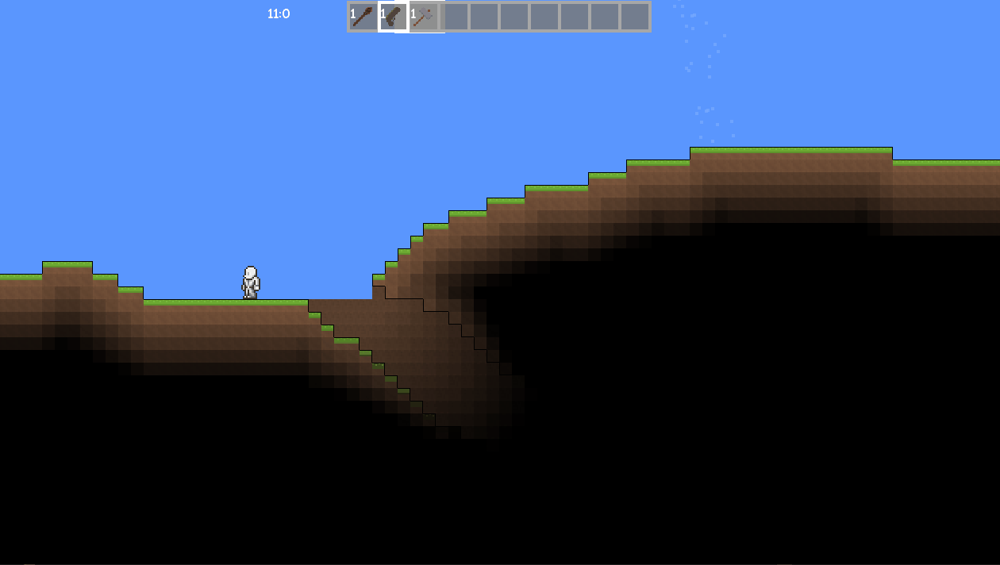

# MonoGame-Terraria-Clone
A 2D sandbox game similar to Terraria that I made using MonoGame in 2020

WARNING: This project used an old/outdated version of MonoGame (3.7.1) which may be incompatable with the current version. A change to the .csproj file may be required to rebuild the project.

The character sprite used is from the official Terraria game.

## Features
- Place and destroy blocks!
- Use the hammer to destroy walls (background blocks)

- Shoot fireballs using the staff
- Real-time light calculation

- Shoot bullets using the gun
- Day-Night cycle
- Zombies spawn in the night

- Press shift for a cool spell effect thingy

